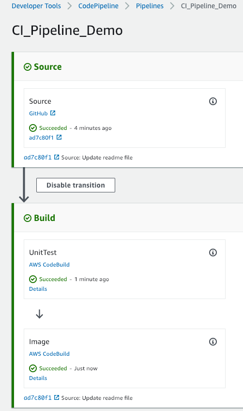
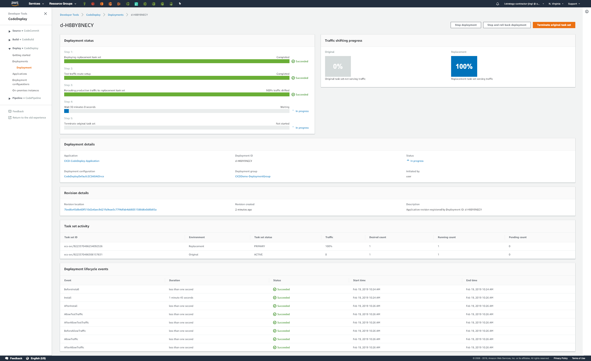
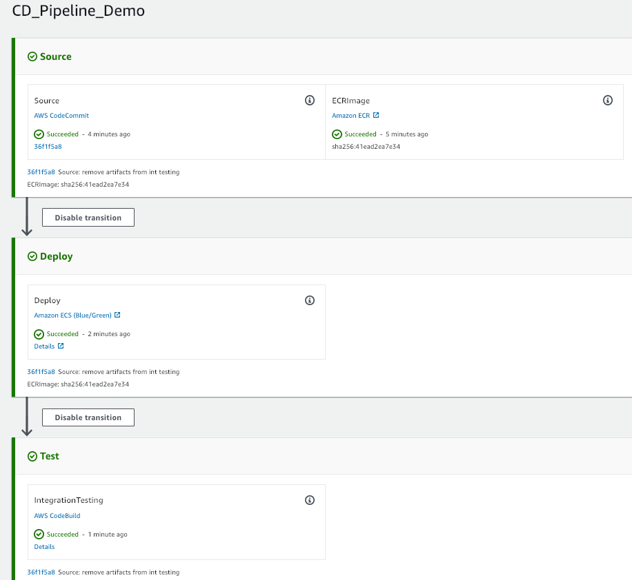

# Create a Pipeline with an Github Source and Deploy to ECS-Fargate
This is a sample project shows you how to create a complete, end-to-end continuous integration and continuous deployment (CICD) pipeline with AWS CodePipeline. It walks you through setting up a pipeline to build and deploy your application when code is updated in github.

# Running the Sample

## Prerequisites:

1. Generate a personal access token for your CodeBuild project.  
    * In Github > Settings > Developer settings > Personal access tokens > [Generate new token].
    * When you create the personal access token, include the "repo" scope in the definition:
        * repo: Grants full control of private repositories.
        * repo:status: Grants access to commit statuses.
        * admin:repo_hook: Grants full control of repository hooks. This scope is not required if your token has the repo scope.
    * Copy it to your clipboard so that it can be used when you create your CodeBuild project.
1. Create an image repository in Amazon ECR named "cicd-demo" and update buildspec-image.yml with push commands to this repo.

## Step 1: Create a CodeBuild Project for Unit Test

1. Create CodeBuild Project with below settings: (e.g. CICD-CodeBuild-UnitTest)
    * Source provider: GitHub
    * Repository: Connect with a GitHub personal access token.
    * Github personal access token: paste the token you copied to your clipboard and choose Save Token
    * Repository URL: https://github.com/jing-1strategy/sm-cicd-sample
    * Select Rebuild every time a code change is pushed to this repository
    * Event type: PUSH (or others depends on the requirement)
    * Environment:
        * choose Managed image
        * Operating system: Ubuntu
        * Runtime: Python
        * Runtime version: aws/codebuild/python:3.7.1
    * Service Role:
        * Select [New service role]
        * Role name: accept the default name.
    * Buildspec
        * Use a buildspec file.
        * Buildspec name: buildspec-unit-test.yml

## Step 2: Create a CodeBuild Project for push docker image to ECR

1. Create CodeBuild Project with below settings: (e.g. CICD-CodeBuild-Image)

    * Source provider: GitHub
    * Github repository: jing-1strategy/sm-cicd-sample
    * Select Rebuild every time a code change is pushed to this repository
    * Event type: PUSH (or others depends on the requirement)
    * Environment:
        * choose Managed image
        * Operating system: Ubuntu
        * Runtime: Docker
        * Runtime version: aws/codebuild/docker:18.09.0
    * Service Role:
        * Select [New service role]
        * Role name: accept the default name.
    * Buildspec
        * Use a buildspec file.
        * Buildspec name: buildspec-image.yml

1. Add below policy to the CodeBuild service role to allow pushing image to ECR:

    ```json
    {
    "Statement": [
        {
        "Action": [
            "ecr:BatchCheckLayerAvailability",
            "ecr:CompleteLayerUpload",
            "ecr:GetAuthorizationToken",
            "ecr:InitiateLayerUpload",
            "ecr:PutImage",
            "ecr:UploadLayerPart"
        ],
        "Resource": "*",
        "Effect": "Allow"
        },
    ],
    "Version": "2012-10-17"
    }

    ```

## Step 3: Create a Continuous Integration Pipeline

1. Go to CodePipeline > Create pipeline:
    * Pipeline name: CI_Pipeline_Demo
    * Service role:
        * Select [New service role]
        * Role name: accept the default name
    * Artifact store: Default location
    * Source provider: Guthub
    * Repository: jing-1strategy/sm-cicd-sample
    * Branch: master
    * Change detection options: GitHub webhooks (recommended)
    * Build provider: AWS CodeBuild
    * Project name: CICD-CodeBuild-UnitTest
    * Deploy provider: Skip deploy stage

1. Add build and push docker image stage to the CI pipeline
    * Choose the CI pipeline. In the upper left, choose Edit.
    * In the Build stage, choose [Edit stage]
    * Rename action name from "Build" to "UnitTest"
    * Add action group after existing action:
        * Action name: Image
        * Action provider: AWS CodeBuild
        * Input artifacts: SourceArtifact
        * Project name: CICD-CodeBuild-Image
        * Output artifacts: ImageOutput

1. Save and Release change all the change.


## Step 4: Create CodeDeploy Application and Deployment Group (Fargate Compute Platform)

1. Update a task definition JSON file and register it with Amazon ECS

    * Create ecsTaskExecutionRole with AmazonECSTaskExecutionRolePolicy

    * Update Task Definition Source File (taskdef.json) with ecsTaskExecutionRole arn and ECR image name

    * Register your task definition with the taskdef.json file.

    ```bash
    aws ecs register-task-definition --cli-input-json file://taskdef.json
    ```

    * After the task definition is registered, edit your file to remove the image name and include the <IMAGE1_NAME> placeholder text in the image field.

    * Note: In appspec.yaml, for TaskDefinition, do not change the <TASK_DEFINITION> placeholder text. This value is updated when your pipeline runs.

1.  Create Application Load Balancer and Target Groups

    * Create Application Load Balancer with below settings:
        * Scheme: internet-facing.
        * Security Group: Open HTTP 80 and HTTP 8080 to 0.0.0.0/0
        * Configure two listener ports for your load balancer:
            * Under Load Balancer Protocol, choose HTTP. Under Load Balancer Port, enter 80
            * Choose Add listener
            * Under Load Balancer Protocol for the second listener, choose HTTP. Under Load Balancer Port, enter 8080.
            * In Target group, choose New target group and configure your first target group:
                * In Name, enter a target group name (for example, cicd-demo-tg-1)
                * In Target type, choose IP
                * In Protocol choose HTTP. In Port, enter 80
            * Create a second target group for your load balancer
                * In Name, enter a target group name (for example, cicd-demo-tg-2)
                * In Target type, choose IP
                * In Protocol choose HTTP. In Port, enter 8080
            * Update your load balancer to include your second target group

1. Create Your Amazon ECS Fargate Cluster and Service
    * Create a ECS Fargate Cluster named CICD-DEMO
    * Update create-service.json, for security group, open port 5000 to the ALB security group
    * run the create-service command:

    ```bash
    aws ecs create-service --service-name cicd-demo-service --cli-input-json file://create-service.json
    ```

1. Create CodeDeploy Application and Deployment Group
    * Create an CodeDeploy application with below settings:
        * Application name: CICD-CodeDeploy-Application
        * Compute platform: Amazon ECS

    * Create an CodeDeploy deployment group with below settings:
        * Deployment group name: CICDDemo-DeploymentGroup
        * Service Role: choose AWSCodeDeployRoleForECS (with AWS managed policy AWSCodeDeployRoleForECS)
        * ECS cluster name: CICD-DEMO
        * Choose an ECS service name: cicd-demo-service
        * Load balancer: cicd-demo-alb
        * Production listener port: HTTP: 80
        * Test listener port : HTTP:8080
        * Target group 1 name: cicd-demo-tg-1
        * Target group 2 name: cicd-demo-tg-2
        * Deployment settings: Reroute traffic immediately

## Step 5: Create a CodeCommit Repository and push configuration files of CD pipeline to it

1. Create a CodeCommit repository: e.g.CICD-Demo-CodeDeploy-Config
1. Push below files to your CodeCommit repository:
    * appspec.yaml
    * taskdef.json
    * buildspec-integration-test.yml
    * create-service.json
    * /tests/*

Note: please update the value of BASE_URL with ALB DNS name, this is the endpoint for the integration testing

## Step 6: Create a Continuous Delivery Pipeline

1. Go to CodePipeline > Create pipeline:
    * Pipeline name: CD_Pipeline_Demo
    * Service role:
        * Select [New service role]
        * Role name: accept the default name
        * Artifact store: Default location
        * Source provider: CodeCommit
        * Repository name: CICD-Demo-CodeDeploy-Config
        * Branch: master
        * Change detection options: Amazon CloudWatch Events (recommended)
        * Build Provider: Skip build stage
        * Deploy Provider: Amazon ECS (Blue/Green)
        * AWS CodeDeploy application name: CICD-CodeDeploy-Application
        * AWS CodeDeploy deployment group: CICD-Demo-DeploymentGroup
        * Amazon ECS task definition:
            * SourceArtifact: taskdef.json
            * SourceArtifact: appspec.yaml

1. Add an Amazon ECR source action to your pipeline
    * Choose your pipeline. In the upper left, choose Edit.
    * In the source stage, choose Edit stage.
    * Add a parallel action by choosing + Add action next to your CodeCommit source action.
    * In Action name, enter a name (for example, ECRImage).
    * In Action provider, choose Amazon ECR.
    * In Repository name, choose the name of your Amazon ECR repository.
    * In Image tag, specify the image name and version, if different from latest.
    * In Output artifacts, choose the output artifact (for example, ECRImageOutput)
    * Choose Save

1. Wire your source artifacts to the Deploy action
    * Choose Edit on your Deploy stage and choose the icon to edit the Amazon ECS (Blue/Green) action.
    * In Input artifacts, choose Add. Add the source artifact from your new Amazon ECR repository (for example, ECRImageOutput).
    * In Task Definition, choose SourceArtifact, and then enter taskdef.json.
    * In AWS CodeDeploy AppSpec File, choose SourceArtifact and enter appspec.yaml.
    * In Dynamically update task definition image, in Input Artifact with Image URI, choose ECRImageOutput, and then enter the placeholder text that is used in the taskdef.json file: "IMAGE1_NAME". Choose Save.

1. Save and release change to the pipeline.

1. After the traffic is routed to replacement task set, click [Terminate original task set], so you don't have to wait for time out:



## Step 7: Add Integration Testing to the Continuous Delivery Pipeline

1. Copy and paste buildspec-integration-test.yml to codecommit repo

1. Create CodeBuild Project with below settings: (e.g. CICD-CodeBuild-IntTest)

    * Source provider: CodeCommit
    * Github repository: CICD-Demo-CodeDeploy-Config
    * Environment:
        * choose Managed image
        * Operating system: Ubuntu
        * Runtime: Node.js
        * Runtime version: aws/codebuild/nodejs:10.14.1
    * Service Role:
        * Select [New service role]
        * Role name: accept the default name.
    * Buildspec
        * Use a buildspec file.
        * Buildspec name: buildspec-integration-test.yml

1. Add Integration Test Stage to the pipeline
    * Choose your pipeline. In the upper left, choose Edit.
    * Click [Add stage] under Deploy stage, enter name "Test"
    * Add action group to Test stage:
        * Action name: IntegrationTesting
        * Action Provider: AWS CodeBuild
        * Input artifacts: SourceArtifact
        * Project name: CICD-CodeBuild-IntTest
        * Output artifacts: IntTestOutput

1. Save and release change to the pipeline.

1. Make a change to the source repo and push to github, the CD pipeline should be up:


